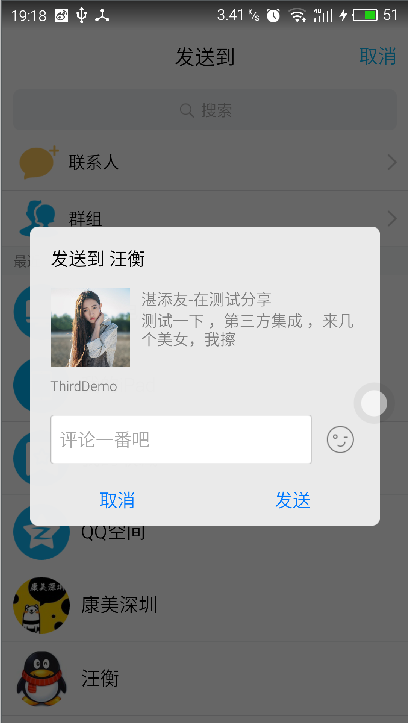
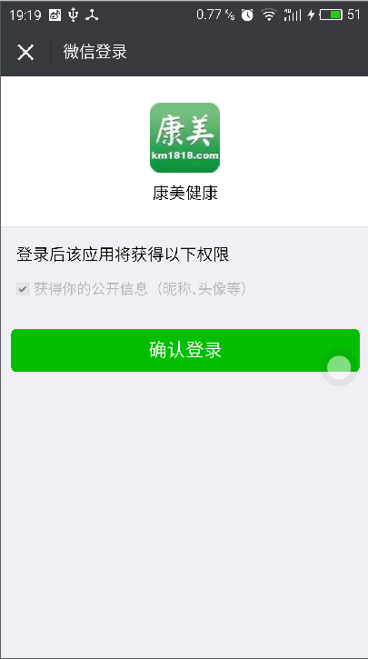

# ThirdLogin_Share
微信,qq,新浪微博的分享与登录集成

## 说明
基于对[ShareLogin](https://github.com/lingochamp/ShareLoginLib)的修改，由于这个库引用了一些第三方库，但是我项目没有用到，所以把这些东西都去掉了，所以的异步请求等都交给调用者实现。

##配置

	//APPid
	public class Const {
	    public static final String QQ_APP_ID = "***";
	    public static final String WEI_CHAT_APP_ID = "***";
	    public static final String WEI_CHAT_APP_SECRET = "***";
	    public static final String SINA_APP_KEY = "***";

	//你的正式签名
 	signingConfigs {
        debug {
            keyAlias '***'
            keyPassword '***'
            storeFile file('***')
            storePassword '***'
        }
    }

}

##代码

		初始化AppID
	    ThirdDataProvieder.initQQ(Const.QQ_APP_ID);
        ThirdDataProvieder.initWechat(Const.WEI_CHAT_APP_ID, Const.WEI_CHAT_APP_SECRET);
        ThirdDataProvieder.initWeibo(Const.SINA_APP_KEY);
		
		mQqShareManager = new QQShareManager(this);
        mQqLoginManager = new QQLoginManager(this);
        mWeiChatShareManager = new WeiChatShareManager(this);
        mWeiChatLoginManager = new WeiChatLoginManager(this);
        mWeiboShareManager = new SinaShareManager(this);
        mWeiboLoginManager = new SinaLoginManager(this);

		//qq登录
		 mQqLoginManager.login(new QQLoginCallBack() {
            @Override
            public void onComplete(QQLoginInfo userInfo) {
                Log.d("MainActivity", "userInfo:" + userInfo);
            }

            @Override
            public void onError() {
                Log.d("MainActivity", "onError:");
            }

            @Override
            public void onCancel() {
                Log.d("MainActivity", "onCancel:");
            }
        });
		//qq分享
		    public void qqZoneShare(View view) {
		        qShare(QQShareManager.QZONE);
		
		    }
		
		    public void qqShare(View view) {
		
		        qShare(QQShareManager.QQ);
		
		    }

		//其他类似

## 截图

